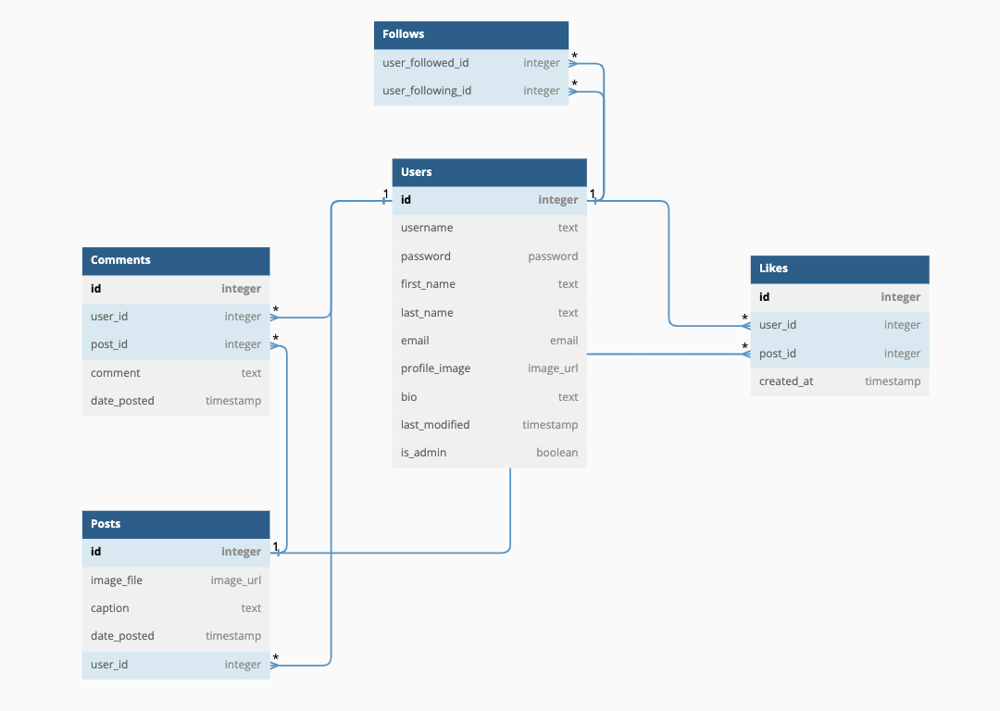

# **Instagram Clone**
Try it out! ---> [Instagram Clone](insta_caeden.surge.sh).

## **Overview:**
The goal of this app was to showcase my ability to build a __full-stack__ application with my own custom node.js backend API and React frontend. The application mirrors the features and user flow of an earlier version of Instagram which only featured photographs. 

## **Features & Functionality**
Mimicking the original Instagram, the main features of the application are to allow users to share photos and explore images posted by other users. Users who create an account have the additional ability to:
- like posts
- comment 
- follow other users
- explore their own profile data (likes, followers, following)

## **User Flow**
To use the application, users will initially be asked to sign up or login to an existing profile. 

Once logged in, the user will be guided to a greeting page with the option to direct to the explore page (main feed) which shows posts in descending order (newest first) from every user in the database. 

Posts on the main feed will display the username, image, and caption. 

To like, comment, or delete a post (if the post is created by the logged in user), the user can click into a Link which is embedded in each individual post on the main feed to see more details. 

Users can also navigate to their own profile and see a grid display of their posts along with their profile data (likes, followers, following). Here, logged in users can choose to edit their profile or delete their profile. If not the logged in user, users will see a "Follow" button as opposed to an edit/delete profile button. 

Hovering over and clicking on the (likes, followers, following) will lead them to a grid display of their liked posts, list of followers, or list of people they are following, respectively. 

To create a post, users can click on the navigation link up top which will lead them to a form which accepts an Image URL and text caption. 

## **Custom API**
The API used for this application was created and designed by me. The API consists of standard CRUD functions and follows RESTful architecural guidelines. 

## **API Overview**
To see how the API works, please refer to my [Backend repository] to explore my models, routes, and schema. I've included extensive comments throughout my code to help viewers understand and have a clearer image of my thought process. 

To see how the frontend links to and communicates with my backend API, refer to the [API file] in my frontend repository. 

## **Database Schema**

## **Technologies Used**
- JavaScript
- Node.js
- Express
- React
- PostgreSQL
- SQL
- CSS
- Bootstrap
- Material UI
- Unit Tests
- Surge
- Heroku
- VSCode

